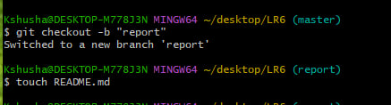
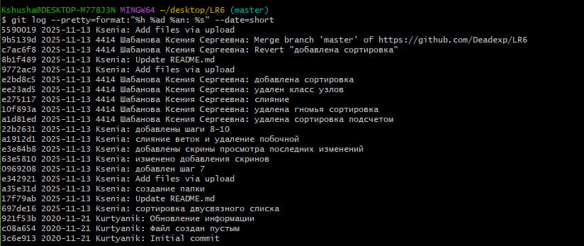

# Отчет о лабораторной работе №6
**Цель работы:** изучение базовых возможностей системы управления версиями, опыт работы с Git Api, опыт работы с локальным и удаленным репозиторием.

**Ход работы:**  
Шаги 1-6: выполнены заранее  

Шаг 7: Получить историю операций для каждой из веток  
  
  

Шаг 8: Просмотреть последние изменения  
 
  

Шаг 9: Выполнить слияние в ветку master, разрешив конфликт  
  
  

Шаг 10: Удалить побочную ветку после успешного слияния  
  
  

Шаг 11: Сделать изменения и зафиксировать их, оставляя комментарии, несколько раз  
  
  

Шаг 12: Сделать откат коммита  
После отката коммита пропали строки с командами, с помощью которых и происходил откат  
Порядок отката был следующим:  
  1. получаем коммиты с помощью команды git log --oneline  
  2. находим хэш необходимого коммита (в моем случае хэш e2bd8c5)  
  3. применяем команду git revert e2bd8c5

Шаг 13: Создать ветку для отчёта  
  

Шаг 14: Получить историю операций в форматированном виде (сокращённый
хэш + дата + имя автора + комментарий). Добавить её в отчёт и сделать
финальную фиксацию изменений  
  

**Вывод:** я изучила базовые возможности системы управления версиями, получила опыт работы с Git Api, опыт работы с локальным и удаленным репозиторием.
