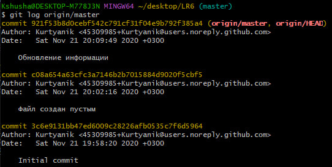
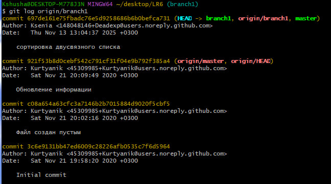
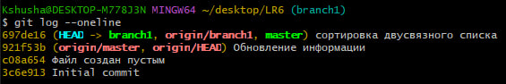
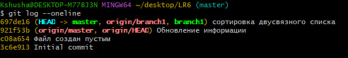
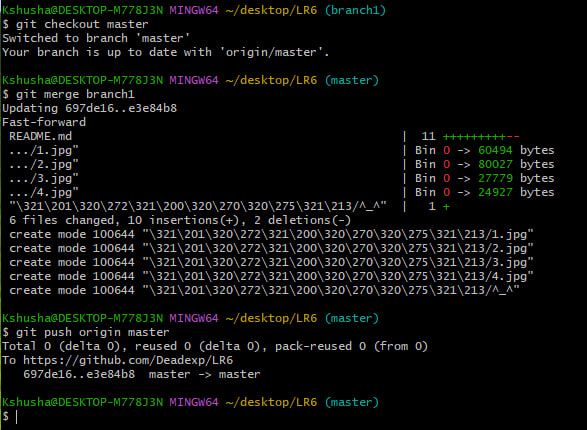
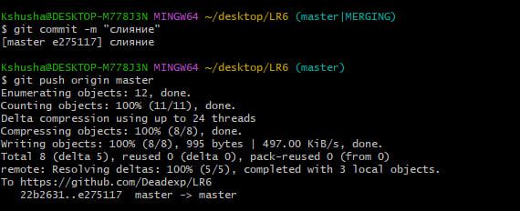
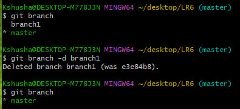
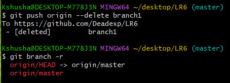
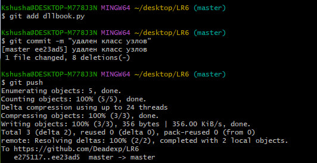
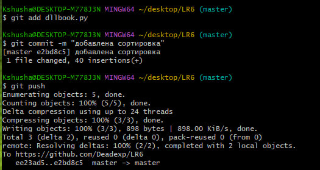

# Отчет о лабораторной работе №6
**Цель работы:** изучение базовых возможностей системы управления версиями, опыт работы с Git Api, опыт работы с локальным и удаленным репозиторием.

**Ход работы:**  
Шаги 1-6: выполнены заранее  

Шаг 7: Получить историю операций для каждой из веток  
  
  

Шаг 8: Просмотреть последние изменения  
 
  

Шаг 9: Выполнить слияние в ветку master, разрешив конфликт  
  
  

Шаг 10: Удалить побочную ветку после успешного слияния
  
  

Шаг 11: Сделать изменения и зафиксировать их, оставляя комментарии, несколько раз  
  

